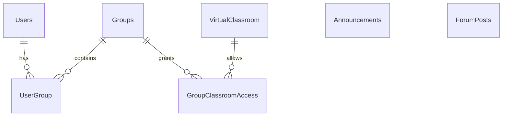
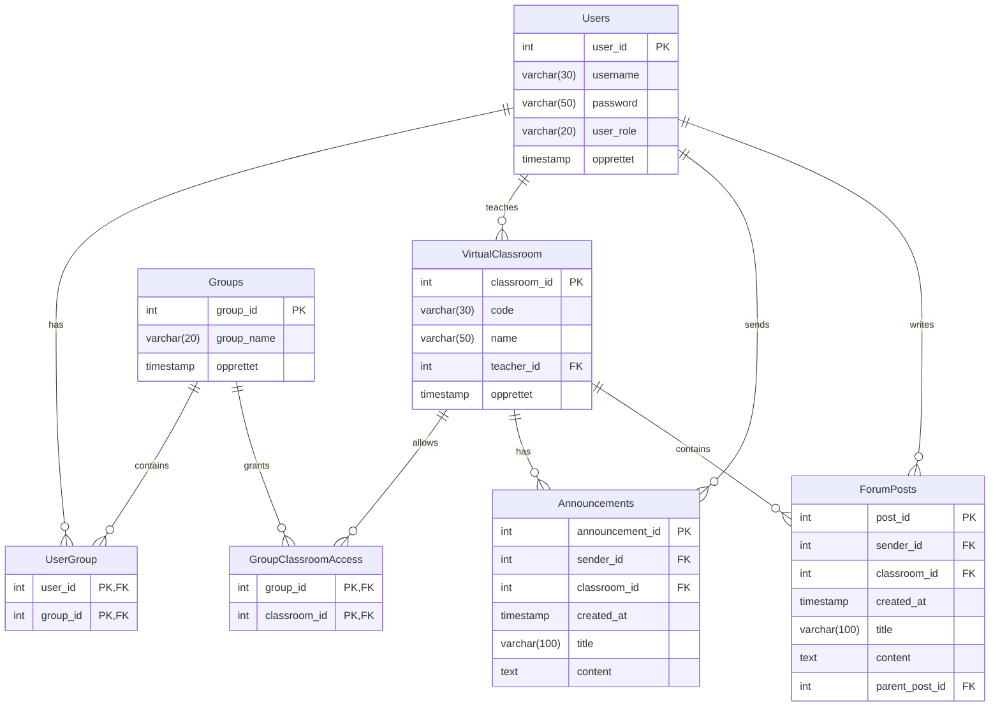

# Oppgavesett 1.4: Databasemodell og implementasjon for Nettbasert Undervisning

I dette oppgavesettet skal du designe en database for et nettbasert undervisningssystem. Les casen nøye og løs de fire deloppgavene som følger.

Denne oppgaven er en øving og det forventes ikke at du kan alt som det er spurt etter her. Vi skal gå gjennom mange av disse tingene detaljert i de nærmeste ukene. En lignende oppbygging av oppgavesettet, er det ikke helt utelukket at, skal bli brukt i eksamensoppgaven.

Du bruker denne filen for å besvare deloppgavene. Du må eventuelt selv finne ut hvordan du kan legge inn bilder (images) i en Markdown-fil som denne. Da kan du ta et bilde av dine ER-diagrammer, legge bildefilen inn på en lokasjon i repository og henvise til filen med syntaksen i Markdown. 

Det er anbefalt å tegne ER-diagrammer med [mermaid.live](https://mermaid.live/) og legge koden inn i Markdown (denne filen) på følgende måte:
```
```mermaid
erDiagram
    studenter 
    ...
``` 
Det finnes bra dokumentasjon [EntityRelationshipDiagram](https://mermaid.js.org/syntax/entityRelationshipDiagram.html) for hvordan tegne ER-diagrammer med mermaid-kode. 

## Case: Databasesystem for Nettbasert Undervisning

Det skal lages et databasesystem for nettbasert undervisning. Brukere av systemet er studenter og lærere, som alle logger på med brukernavn og passord. Det skal være mulig å opprette virtuelle klasserom. Hvert klasserom har en kode, et navn og en lærer som er ansvarlig.

Brukere kan deles inn i grupper. En gruppe kan gis adgang ("nøkkel") til ett eller flere klasserom.

I et klasserom kan studentene lese beskjeder fra læreren. Hvert klasserom har også et diskusjonsforum, der både lærere og studenter kan skrive innlegg. Til et innlegg kan det komme flere svarinnlegg, som det igjen kan komme svar på (en hierarkisk trådstruktur). Både beskjeder og innlegg har en avsender, en dato, en overskrift og et innhold (tekst).

## Del 1: Konseptuell Datamodell

**Oppgave:** Beskriv en konseptuell datamodell (med tekst eller ER-diagram) for systemet. Modellen skal kun inneholde entiteter, som du har valgt, og forholdene mellom dem, med kardinalitet. Du trenger ikke spesifisere attributter i denne delen.

**Ditt svar:*** 



## Del 2: Logisk Skjema (Tabellstruktur)

**Oppgave:** Oversett den konseptuelle modellen til en logisk tabellstruktur. Spesifiser tabellnavn, attributter (kolonner), datatyper, primærnøkler (PK) og fremmednøkler (FK). Tegn et utvidet ER-diagram med [mermaid.live](https://mermaid.live/) eller eventuelt på papir.


**Ditt svar:***



## Del 3: Datadefinisjon (DDL) og Mock-Data

**Oppgave:** Skriv SQL-setninger for å opprette tabellstrukturen (DDL - Data Definition Language) og sett inn realistiske mock-data for å simulere bruk av systemet.


**Ditt svar:***
```sql
CREATE TABLE IF NOT EXISTS users (
    user_id SERIAL PRIMARY KEY,
    username VARCHAR(30) UNIQUE NOT NULL,
    password VARCHAR(50) NOT NULL,
    user_role VARCHAR(20) NOT NULL,
    opprettet TIMESTAMP DEFAULT CURRENT_TIMESTAMP
);

CREATE TABLE IF NOT EXISTS virtualclassroom (
    classroom_id SERIAL PRIMARY KEY,
    code VARCHAR(30) UNIQUE NOT NULL,
    name VARCHAR(50) NOT NULL,
    teacher_id INT NOT NULL REFERENCES users(user_id),
    opprettet TIMESTAMP DEFAULT CURRENT_TIMESTAMP
);

CREATE TABLE IF NOT EXISTS groups (
    group_id SERIAL PRIMARY KEY,
    group_name VARCHAR(20) UNIQUE NOT NULL,
    opprettet TIMESTAMP DEFAULT CURRENT_TIMESTAMP
);

CREATE TABLE IF NOT EXISTS announcements (
    announcement_id SERIAL PRIMARY KEY,
    sender_id INT NOT NULL REFERENCES users(user_id),
    classroom_id INT NOT NULL REFERENCES virtualclassroom(classroom_id),
    created_at TIMESTAMP DEFAULT CURRENT_TIMESTAMP,
    title VARCHAR(100) NOT NULL,
    content TEXT NOT NULL
);

CREATE TABLE IF NOT EXISTS forumposts (
    post_id SERIAL PRIMARY KEY,
    sender_id INT NOT NULL REFERENCES users(user_id),
    classroom_id INT NOT NULL REFERENCES virtualclassroom(classroom_id),
    created_at TIMESTAMP DEFAULT CURRENT_TIMESTAMP,
    title VARCHAR(100) NOT NULL,
    content TEXT NOT NULL,
    parent_post_id INT REFERENCES forumposts(post_id)
);

CREATE TABLE IF NOT EXISTS usergroup (
    user_id INT NOT NULL REFERENCES users(user_id),
    group_id INT NOT NULL REFERENCES groups(group_id),
    PRIMARY KEY (user_id, group_id)
);

CREATE TABLE IF NOT EXISTS groupclassroomaccess (
    group_id INT NOT NULL REFERENCES groups(group_id),
    classroom_id INT NOT NULL REFERENCES virtualclassroom(classroom_id),
    PRIMARY KEY (group_id, classroom_id)
);

INSERT INTO users (username, password, user_role) VALUES
('tom_freddie', 'pass123', 'student'),
('nancy_petruini', 'pass456', 'student'),
('berg_bergerson', 'teachme', 'teacher');

INSERT INTO virtualclassroom (code, name, teacher_id) VALUES
('DATA1500', 'Databases and Data Modeling', 3);

INSERT INTO groups (group_name) VALUES
('Group A'),
('Group B');

INSERT INTO usergroup (user_id, group_id) VALUES
(1, 1),
(2, 1);

INSERT INTO groupclassroomaccess (group_id, classroom_id) VALUES
(1, 1);

INSERT INTO announcements (sender_id, classroom_id, title, content) VALUES
(3, 1, 'Welcome to DATA1500',
 'Welcome everyone! All course information will be posted here.');

INSERT INTO forumposts (sender_id, classroom_id, title, content) VALUES
(1, 1, 'Question about assignments',
 'Will the assignments be individual or group based?');

INSERT INTO forumposts (sender_id, classroom_id, title, content, parent_post_id) VALUES
(3, 1, 'Re: Question about assignments',
 'Assignments will be individual.', 1);
```

## Del 4: Spørringer mot Databasen

**Oppgave:** Skriv SQL-spørringer for å hente ut informasjonen beskrevet under. For hver oppgave skal du levere svar med både relasjonsalgebra-notasjon og standard SQL.

### 1. Finn de 3 nyeste beskjeder fra læreren i et gitt klasserom (f.eks. klasserom_id = 1).

*   **Relasjonsalgebra:**
    > 

*   **SQL:**
    ```sql
    
    ```

### 2. Vis en hel diskusjonstråd startet av en spesifikk student (f.eks. avsender_id = 2).

*   **Relasjonsalgebra**
    > Trenger ikke å skrive en relasjonsalgebra setning her, siden det blir for komplekst og uoversiktlig. 

*   **SQL (med `WITH RECURSIVE`):**

    Du kan vente med denne oppgaven til vi har gått gjennom avanserte SQL-spørringer (tips: må bruke en rekursiv konstruksjon `WITH RECURSIVE diskusjonstraad AS (..) SELECT FROM diskusjonstraad ...`)
    ```sql
    
    ```

### 3. Finn alle studenter i en spesifikk gruppe (f.eks. gruppe_id = 1).

*   **Relasjonsalgebra:**
    > 

*   **SQL:**
    ```sql
    
    ```

### 4. Finn antall grupper.

*   **Relasjonsalgebra (med aggregering):**
    > 

*   **SQL:**
    ```sql
    
    ```

## Del 5: Implementer i postgreSQL i din Docker container

**Oppgave:** Gjenbruk `docker-compose.yml` fra Oppgavesett 1.3 (er i denne repositorien allerede, så du trenger ikke å gjøre noen endringer) og prøv å legge inn din skript for opprettelse av databasen for nettbasert undervsining med noen testdata i filen `01-init-database.sql` i mappen `init-scripts`. Du trenger ikke å opprette roller. 

Lagre alle SQL-spørringene dine fra oppgave 4 i en fil `oppgave4_losning.sql` i mappen `test-scripts` for at man kan teste disse med kommando:

```bash
docker-compose exec postgres psql -U admin -d data1500_db -f test-scripts/oppgave4_losning.sql
```
